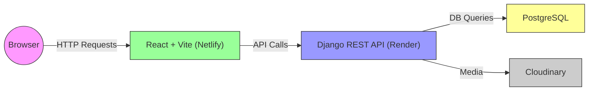

# Architecture Overview

This document provides a high-level look at how the Task Management System is organized. It covers the **frontend** (React + Vite), **backend** (Django REST Framework), the **database** (PostgreSQL), and any external services (like Cloudinary for media storage and hosting platforms like Render or Netlify).

---

## 1. High-Level Diagram

Below is a simplified diagram of the system’s architecture:

- **Frontend (Netlify)**: The React application is bundled with Vite and served via static hosting (e.g., Netlify).  
- **Backend (Render)**: The Django REST API is hosted on a platform like Render, communicating with the database and external services.  
- **PostgreSQL**: The primary data store for tasks, users, and other relational data.  
- **Cloudinary**: Stores user-uploaded media (images, etc.).  
- **User’s Browser**: Makes requests to the frontend (served on Netlify) which then calls the backend API routes.

---

## 2. Frontend (React + Vite)

- **React**: Renders the UI and handles client-side routing (React Router).  
- **Vite**: Builds and bundles the application for development and production.  
- **Data Fetching**: Uses libraries like `axios` or `fetch` to call the Django REST API at URLs defined by environment variables (e.g., `VITE_REACT_APP_API_BASE_URL`).  
- **Hosting**: Deployed as static files on Netlify (or another service), which simply serves the compiled `dist/` folder.

---

## 3. Backend (Django REST Framework)

- **Django**: The main Python web framework.  
- **Django REST Framework (DRF)**: Exposes RESTful endpoints for tasks, users, comments, etc.  
- **Database Interaction**: Relies on PostgreSQL via `dj_database_url` or standard Django DB settings.  
- **Authentication**: Uses `rest_framework_simplejwt` for JWT-based token authentication.  
- **Static/Media Files**:  
    - **WhiteNoise**: Used for static files in production.  
    - **Cloudinary**: Used for media file storage (images, attachments).  
- **Hosting**: Render (or any other provider) runs the Django server process.  

---

## 4. Database (PostgreSQL)

- **Primary Data Store**: Stores all persistent data: user info, tasks, comments, team data, etc.  
- **Migrations**: Handled via Django (`manage.py migrate`), ensuring schema consistency.  
- **Configuration**: `DATABASE_URL` environment variable sets the connection details (local or managed cloud DB).

---

## 5. External Services

### 5.1 Cloudinary

- Used for **media storage** (e.g., user profile images, attachments).  
- Configured in `settings.py` with `CLOUDINARY_*` environment variables (and `django-cloudinary-storage`).  
- Provides URLs for accessing stored images/files.

### 5.2 Mailgun (Optional)

- If email notifications or password resets are configured, Mailgun handles sending transactional emails.  
- `ANYMAIL` config in `settings.py` references `MAILGUN_API_KEY` and domain.

### 5.3 Deployment Platforms

- **Render**: Hosts the Django backend.  
  - Typically you set up a Build Command (`pip install -r requirements.txt; python manage.py collectstatic`) and a Start Command (`gunicorn backend.wsgi`).  
- **Netlify**: Hosts the React frontend.  
  - Build Command: `yarn build` (or `npm run build`)  
  - Publish Directory: `dist`

---

## 6. Communication Flow

1. **User Visits Frontend**:  
   - The browser requests static files (HTML/CSS/JS) from Netlify’s servers.  

2. **Frontend → Backend**:  
   - The React app uses `axios` or `fetch` to send requests to the Django REST endpoints (e.g., `/api/v1/tasks/`).  
   - Sends JWT tokens in request headers (if authentication is required).  

3. **Backend → Database**:  
   - Django queries the PostgreSQL DB to fetch or store task/user data.  
   - If there are media uploads, the files go to Cloudinary, and the DB stores a reference to the Cloudinary file URL.  

4. **Response**:  
   - The Django REST API sends back JSON data, which React renders into the UI (e.g., list of tasks).  

---

## 7. Security & Authentication

- **JWT Auth**:  
  - Uses `SIMPLE_JWT` config in `settings.py` for token issuance (access + refresh tokens).  
  - Frontend stores tokens (e.g., in localStorage or cookies) and includes them in request headers (`Authorization: Bearer <token>`).
- **CORS Headers**:  
  - Django uses `django-cors-headers` to allow requests from the Netlify domain (`CORS_ALLOW_ALL_ORIGINS = True` in development or a restricted list in production).

---

## 8. Key Points & Best Practices

1. **Environment Variables**  
   - Keep secrets (DB credentials, API keys) out of code; use `.env` files or platform-specific environment variable settings.  
2. **Version Control**  
   - Store all code in a single repo (monorepo) or separate repos for frontend/backend, but keep them in sync.  
3. **Scalability**  
   - For heavier loads, you can scale horizontally on Render (multiple instances of Django) and keep your PostgreSQL instance properly sized.  
   - Netlify handles scaling for the static frontend automatically.  
4. **CD/CI**  
   - Automate builds and tests so that each push to `main` triggers deployment or at least a test build.  

---

## Conclusion

This architecture ensures **clear separation** of concerns:

- The **React + Vite** frontend handles all user-facing interfaces and renders dynamic content fetched from the Django REST API.  
- The **Django REST** backend serves as the centralized data and logic layer, interfacing with a PostgreSQL database and media storage in Cloudinary.  
- Hosting platforms (Render, Netlify) provide scalable environments to deploy your code with minimal DevOps overhead.

Use this overview as a reference for how different parts of the system communicate, and refer to the **Setup** guides for detailed installation and configuration steps.